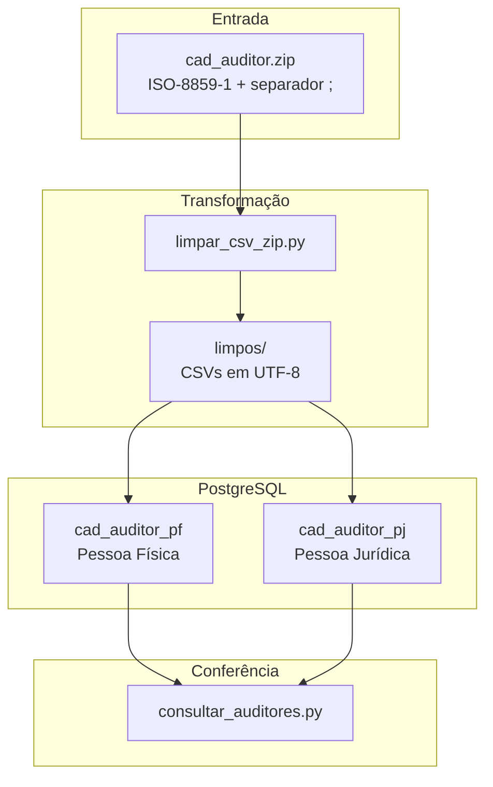

# ETL Cadastro de Auditores CVM — Extração, Limpeza e Carga no PostgreSQL

## Visão Geral

Este projeto implementa um pipeline ETL para processar os arquivos de cadastro de auditores da CVM, cobrindo desde a extração e limpeza dos CSVs compactados até a carga estruturada no PostgreSQL para consulta e análise.

### Etapas do Pipeline

| Etapa           | Descrição                                                                          | Script                       |
|-----------------|------------------------------------------------------------------------------------|------------------------------|
| **Validação**   | Testa a conexão com o banco e valida as credenciais do `.env`                      | `teste_conexao.py`           |
| **Limpeza**     | Extrai o ZIP, converte encoding de ISO-8859-1 para UTF-8 e salva em `limpos/`      | `limpar_csv_zip.py`          |
| **Carga**       | Importa cada CSV da pasta `limpos/` como tabela no PostgreSQL                      | `importar_csvs_postgres.py`  |
| **Consulta**    | Exibe as 10 primeiras linhas de cada tabela importada para conferência              | `consultar_auditores.py`     |

### Fluxo de Processamento

1. **Validação** — Confirma que o banco está acessível antes de qualquer operação
2. **Extração** — Abre `cad_auditor.zip` e lê os CSVs com encoding ISO-8859-1 e separador `;`
3. **Limpeza** — Salva versões limpas em UTF-8 na pasta `limpos/`
4. **Carga** — Importa cada arquivo como tabela individual no PostgreSQL
5. **Conferência** — Consulta os dados importados para validação

---

### Dependências

```bash
pip install -r requirements.txt
```

**Requisitos de ambiente:**

- Python >= 3.10
- PostgreSQL rodando localmente ou acessível via rede

---

## Estrutura do Projeto

```plaintext
.
├── cad_auditor.zip               # Arquivo fonte com os CSVs da CVM
├── limpar_csv_zip.py             # Extração, conversão de encoding e limpeza
├── importar_csvs_postgres.py     # Carga dos CSVs limpos no PostgreSQL
├── consultar_auditores.py        # Consulta de conferência pós-importação
├── teste_conexao.py              # Validação da conexão com o banco
├── requirements.txt              # Dependências do projeto
├── .env                          # Variáveis de ambiente (não versionado)
└── limpos/                       # CSVs limpos em UTF-8 gerados pelo pipeline
```

---

## Configuração

### Variáveis de Ambiente (`.env`)

```env
POSTGRES_USER=postgres
POSTGRES_PASSWORD=sua_senha
POSTGRES_HOST=localhost
POSTGRES_PORT=5432
POSTGRES_DB=nome_do_banco
```

> O arquivo `.env` não é versionado e não deve ser enviado ao repositório.

---

## Execução

### 1. Testar conexão

```bash
python teste_conexao.py
```

### 2. Extrair e limpar os CSVs

```bash
python limpar_csv_zip.py
```

Abre `cad_auditor.zip`, converte o encoding de ISO-8859-1 para UTF-8 e salva os arquivos limpos em `limpos/`.

### 3. Importar para o PostgreSQL

```bash
python importar_csvs_postgres.py
```

### 4. Conferir os dados importados

```bash
python consultar_auditores.py
```

Exibe as 10 primeiras linhas de cada tabela gerada.

---

## Tabelas no PostgreSQL

### `cad_auditor_pf` — Auditores Pessoa Física

| Campo       | Descrição                         |
|-------------|-----------------------------------|
| `cd_cvm`    | Código CVM do auditor             |
| `auditor`   | Nome do auditor                   |
| `sit`       | Situação cadastral                |
| `dt_ini_sit`| Data de início da situação        |

### `cad_auditor_pj` — Auditores Pessoa Jurídica

| Campo         | Descrição                         |
|---------------|-----------------------------------|
| `cd_cvm`      | Código CVM da empresa             |
| `cnpj`        | CNPJ da empresa                   |
| `denom_social`| Denominação social                |
| `sit`         | Situação cadastral                |
| `dt_ini_sit`  | Data de início da situação        |
| `endereço`    | Endereço completo                 |

---

## Diagrama de Arquitetura


